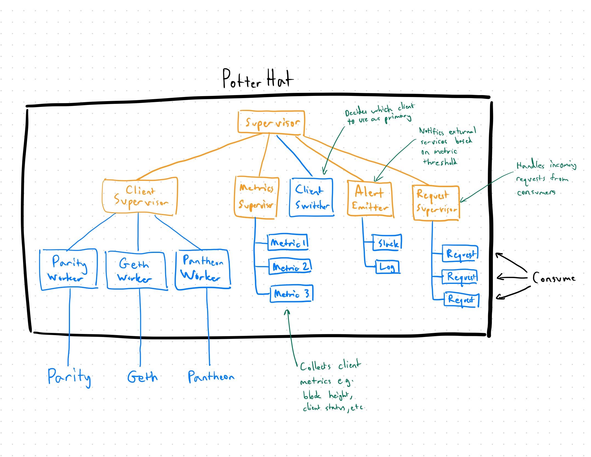

# OIP-0015: PotterHat - A multi-client Ethereum data service

# Simple Summary

PotterHat is a facade application that attempts to provide a consistent and resilient Ethereum data service by unifying the differences between different Ethereum client implementations and routing requests through the Ethereum client that is running with the most up to date data.

It listens to events and data across Ethereum clients, and returns the data that it thinks is the closest to the truth.

# Motivation

Connections to Ethereum can be unreliable. Ethereum integrators therefore need to set up a redundancy mechanism to protect themselves against failures from a single Ethereum node.

However, unlike typical applications where redundancy can be achieved by setting up multiple identical nodes and load-balance over them, hiccups from Ethereum could come from an unstable/faulty client implementation as well. This means that a resilient Ethereum integration not only requires redundancy against a node failure, but also against a failure from the node’s implementation as well.

# Specification

## Requirements

- Requests & responses, including pub/sub, follow the JSON-RPC defined at https://github.com/ethereum/wiki/wiki/JSON-RPC
- Client selection: always switch to the client with the highest block number
- Alerts:
  - When unable to connect to a client
  - When multiple clients are too far apart in block heights (configurable threshold)
